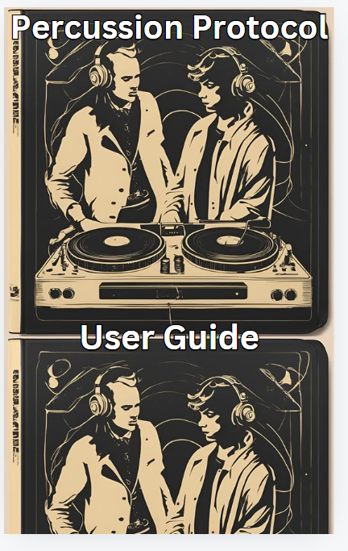
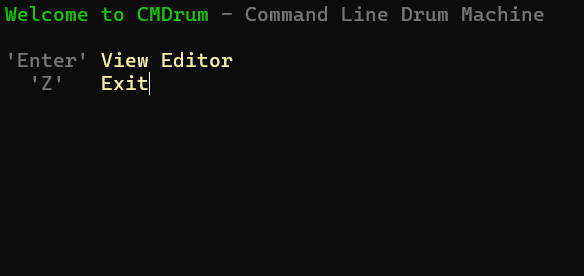
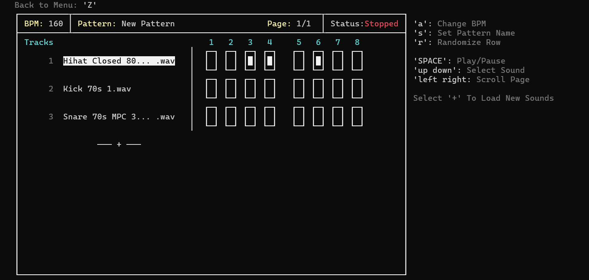

# Percussion Protocol Software Manual
**Authors:** Seb,Alex,Ben,Dante  
**Date:** October 2024

---

## Introduction
This manual provides a comprehensive guide to using the beat-making command-line software. Whether you're a beginner or an experienced user, this manual will help you get started and explore all the features available.

## Getting Started
In this section, we'll walk through the installation process and the basic commands needed to start creating beats. You’ll learn how to:
- Install the software on your system.
- Set up your workspace and configure necessary paths.
- Run your first beat-making command.

## Navigating the Software

When launching the software, the first screen you see provides you with three options:

- Press **Enter** to enter the editor.
- Press **Z** to exit the software.
- Press **P** to choose the number of pages (the number of slots for the beat; the standard is 8).

As you can see in the image above, these options are displayed clearly upon starting the software.

Once you've entered the editor, you will see a table with the following elements:

- **BPM** (Beats Per Minute): Shows the current tempo.
- **Pattern**: Represents the name of the beat you are currently creating.
- **Page Number**: Indicates the current page out of the total number of pages you selected.
- **Status**: Displays whether the beat is playing or paused.

Below these details, you will see the label **Tracks**. Under this, the tracks (music sounds such as kicks, synths, snares, etc.) currently in use are displayed. You can add more tracks by navigating downwards using the arrow keys to the **+** sign and pressing **Enter**, which will show a list of other musical sound options.

To the right of the editor, there are several instructions indicating what certain keys do:

- Pressing **A** opens a window prompting for a new BPM. Entering the desired BPM and pressing **Enter** updates the BPM.

- Pressing **S** opens a window prompting for a pattern name, which you can set as desired. Pressing **Enter** saves the new pattern name.

- Pressing **R** will randomise the beat selection slots. Each press will randomise the selection.

- Pressing **Space** plays the current beat selection. Pressing it again pauses the beat.
- To enter the slots for the beats you want, select the sound you would like to edit (when highlighted in white, it indicates that you are on the beat). The numbers above the slots

## Tips and Tricks

- Depending on the type of beat you are trying to make, you will need to adjust the BPM. Below is a list of genres and their typical tempo ranges:

### Genre BPM Guide

- **Drum and Bass (DNB)**: 160 - 180 BPM  
  DNB is known for its fast-paced, energetic rhythms. Common BPMs for this genre are between 160 and 180.

- **Trap**: 130 - 150 BPM  
  Trap beats often have a slower feel but still contain fast hi-hat rolls. Typical tempos range from 130 to 150 BPM.

- **Rap/Hip-Hop**: 85 - 115 BPM  
  Traditional hip-hop beats are slower and groove-oriented, often sitting between 85 and 115 BPM. However, modern trap-infused hip-hop can be in the 130 - 150 BPM range as well.

- **House**: 120 - 130 BPM  
  House music usually has a steady, four-on-the-floor beat and typically ranges between 120 and 130 BPM.

- **Techno**: 120 - 150 BPM  
  Techno varies in tempo, but most tracks fall between 120 and 150 BPM, offering a driving, rhythmic energy.

- **Dubstep**: 140 BPM  
  Dubstep often sits around 140 BPM, with half-time grooves giving it a slower feel, while the bass drops and wobbles align with the faster tempo.

- **Lo-fi Hip-Hop**: 60 - 90 BPM  
  Lo-fi beats are relaxed and slow, ideal for a chill atmosphere, with tempos usually between 60 and 90 BPM.

- **Reggaeton**: 85 - 100 BPM  
  Reggaeton often has a syncopated rhythm, and its tempos typically range from 85 to 100 BPM.
